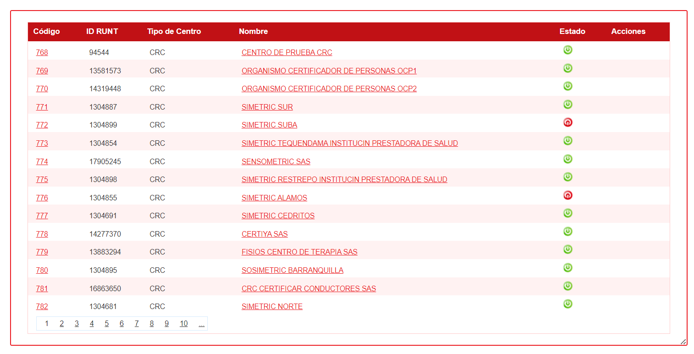

.. autosummary::
   :toctree: generated

6. ADMINISTRACIÓN
=================

En esta sección, podrá encontrar las opciones disponibles para el rol gestor. 

.. raw:: html

   

   

.. image:: ../images/Administración.png
   :width: 50%
   :alt: Menú Administración

.. raw:: html

      
<strong><em>Imagen. Menú Administración</em></strong>

   

6.1 Sociedades
--------

Al seleccionar "Sociedades" en esta pantalla vera la información de sociedades creadas y puede crear nueva sociedad:

.. raw:: html

   

      <strong><em>Imagen. Sociedades</em></strong>
   

En esta pantalla podra realizar las siguientes acciones:

Puede hacer clic en "Nueva sociedad", lo que abrirá una nueva pantalla donde podrá crear la sociedad. En esta pantalla, tendrá la opción de ingresar los datos generales correspondientes.

.. image:: ../images/BotónSociedad.png
   :width: 100%
   :alt: Botón Sociedades

.. raw:: html

   

      <strong><em>Imagen. Botón Sociedades</em></strong>
   

.. raw:: html

   

      <strong><em>Imagen. Sociedades</em></strong>
   

También puede realizar una búsqueda ingresando el nombre de los centros en el filtro y haciendo clic en el botón "Buscar".

.. raw:: html

   

      <strong><em>Imagen. Buscar Sociedades</em></strong>
   

Vera un listado con todas las sociedades creas en esta tabla. 

.. raw:: html

   

      <strong><em>Imagen. Tabla  Sociedades</em></strong>
   

6.2 Centro o Sedes
----------

Si seleccionó en el menú principal "Centro o sedes" vera que en esta pantalla podra realizar las siguientes acciones:

Crear centro

Buscar centro (CRC o CEA)

Tabla con los centros (CRC o CEA)

.. raw:: html

   

      <strong><em>Imagen. Centros O sedes</em></strong>
   

6.2.1 Crear centro
******

Este proceso permite crear un centro en el sistema, donde debera suministrar la informacion de:

.. raw:: html

   

      <strong><em>Imagen. Botón Nuevo Centro</em></strong>
   

.. raw:: html

   

      <strong><em>Imagen. Nuevo Centro</em></strong>
   

**• Información general.**

**• Recaudadores**

**• Tarifas.**

**• Usuarios.**

**• Contigencia.**

.. raw:: html

   

      <strong><em>Imagen. Nuevo Usuario</em></strong>
   

Vera un listado con todas los centros creados en esta tabla. 

.. raw:: html

   

      <strong><em>Imagen. Tabla  Cetros</em></strong>
   

