.. autosummary::
   :toctree: generated

4. TEMARIO DEL MANUAL
=================

•	Sección 1: Describe el Objetivo
•	Sección 2: Describe el Alcance
•	Sección 3: Describe las Definiciones
•	Sección 4: Describe el Temario del manual
•	Sección 5: Describe Ingreso al Sistema de Biometría Dactilar
•	Sección 6: Describe Búsqueda de Empresa
•	Sección 7: Describe Descripción de los Servicios del Sistema de Biometría Dactilar
•	Sección 8: Describe Sedes
•	Sección 9: Describe Equipos	
•	Sección 10: Describe Dispositivos
•	Sección 11: Describe Tipo de trámite 
•	Sección 12: Describe Exportar tipo tramite
•	Sección 13: Describe Consulta ATDP
•	Sección 14: Describe Usuarios
•	Sección 15: Describe Log

5. INGRESO AL SISTEMA DE BIOMETRÍA DACTILAR
=================

El ingreso al sistema de biometría dactilar para el rol RNEC se hará mediante el siguiente link: **https://security-biometric.gse.com.co/Login **

Al ingresar al sistema se podrá ver la siguiente interfaz.

5.1	INICIO DE SESIÓN
----------------------------

•	Para acceder a la plataforma se debe iniciar sesión en https://estatus.gse.com.co/login
•	Para iniciar el proceso de ingreso, se utilizarán las credenciales de email y contraseña.
•	Una vez haya cargado la página, podrá visualizar un recuadro donde solicita ingresar las credenciales de usuario:

.. image:: ../images/1.png
   :width: 80%
   :alt: Ejemplo JSON de respuesta 

**Imagen 1.** Login Biometría Dactilar

Ingrese su nombre de usuario.

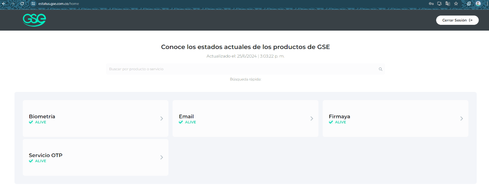

**Imagen 2.** Login Biometría Dactilar – campo usuario

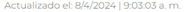

**Imagen 3.** Login Biometría Dactilar – campo usuario

Luego de ingresar su nombre de usuario deberá ingresar su contraseña.

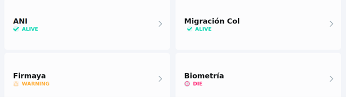

**Imagen 4.**Login Biometría Dactilar – campo contraseña

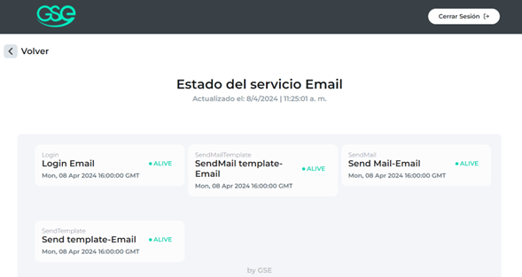

**Imagen 5.** Login Biometría Dactilar – campo contraseña

Seleccione el cuadro de confirmación de “No soy un robot” (Captcha).

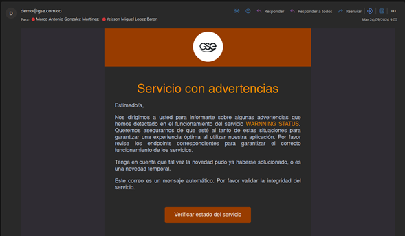

**Imagen 6.** Login Biometría Dactilar – captcha

Luego de seleccionar el cuadro de confirmación, es posible que le solicite una validación adicional, donde deberá seleccionar las imágenes que contengan los elementos presentes en fotografías o seleccionar las imágenes similares entre sí, luego de esto haga clic en  "Verificar".

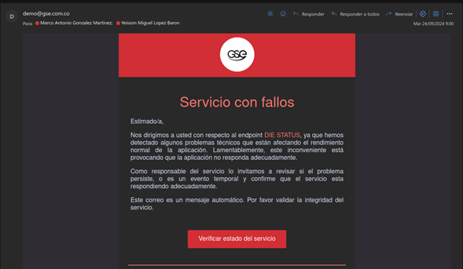

**Imagen 7.** Verificación de imágenes

**Información Importante**
Dispone de la opción de obtener una pista nueva (Captcha) seleccionando el icono  de recarga con lo cual generará una nueva serie de imágenes para seleccionar.

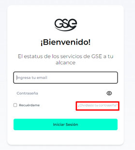

**Imagen 8.** Opción de refrescar imágenes 

Si no desea realizar la validación del cuadro de “No soy un robot” mediante la selección de imágenes dispone de la opción de obtener una pista sonora la cual contiene una serie de letras, frases o números los cuales deberá ingresar (se recomienda uso de audífonos). 

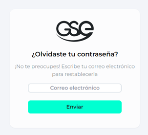

Imagen 9. Icono verificación de audio

De clic en "Reproducir" para escuchar la serie de letras, frases o números de la pista sonora (se recomienda el uso de audífonos).

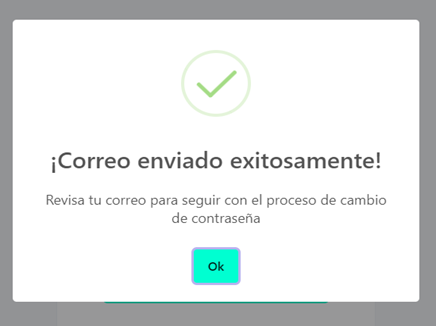

**Imagen 10.** Botón de reproducción de audio

Ingrese la serie de letras, frases o números dados en la pista sonora.  

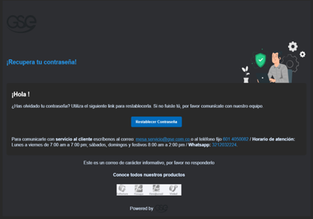

**Imagen 11.** Campo para digitar contenido de audio

De clic en "Verificar"

**Imagen 12.** Botón verificar contenido

Al completar los campos “usuario”, “contraseña” y “No soy un robot”, haga clic en "Ingresar".

.. image:: ../images/13.png
   :width: 80%
   :alt: imagen

**Imagen 13.** Botón Ingresar de login 

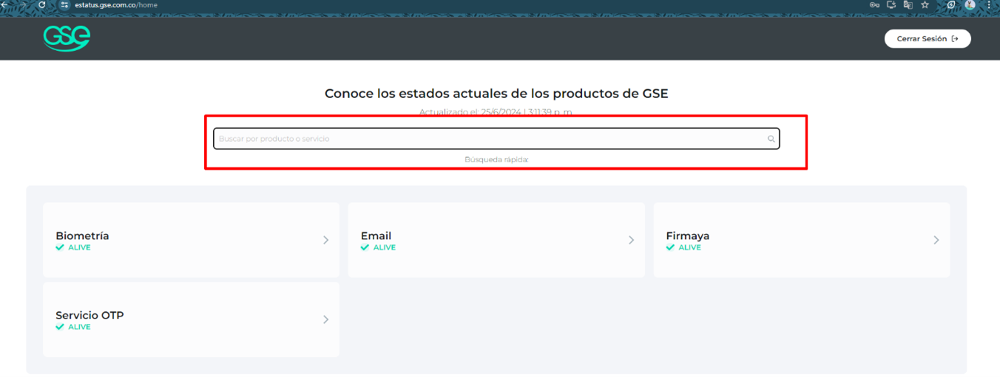

**Imagen 14.** Botón Ingresar de login 

Luego de dar clic en "Ingresar" será redirigido a su pantalla de inicio del sistema de biometría dactilar.

.. image:: ../images/15.png
   :width: 80%
   :alt: imagen

**Imagen 15.** Pantalla de inicio – Búsqueda de empresa