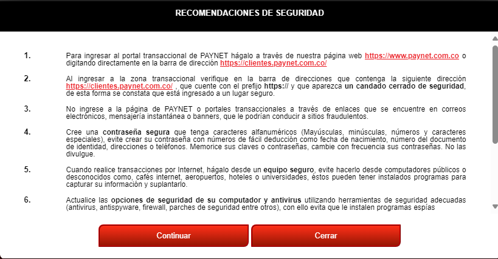
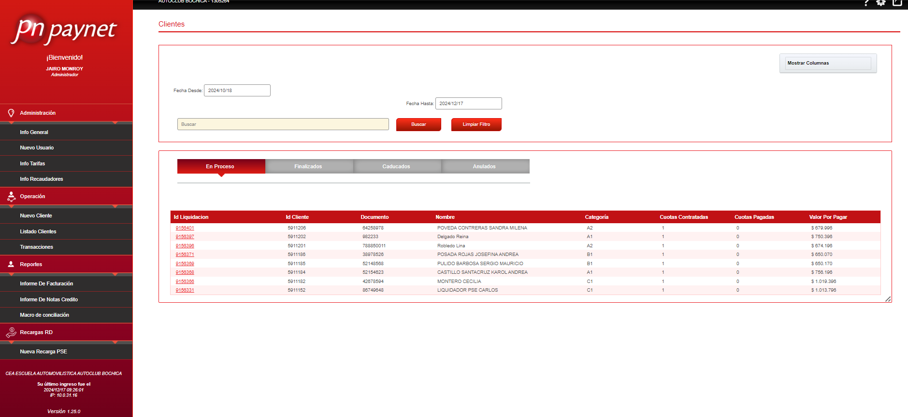

.. autosummary::
   :toctree: generated

5.	LOGIN GESTOR CEA
=================

5.1 Login
--------

Al ingresar debe aceptar las recomendaciones de seguridad, selecione "continuar" para ingresar al inicio de la plataforma, de lo contrario si da clic en cerrar regresara a inicio de sesión.

.. raw:: html

   

      <strong><em>Imagen. Recomendaciones de seguridad </em></strong>
   

Al selecionar "continuar" sera direcionado a la pantalla Clientes

.. raw:: html

   

      <strong><em>Imagen. Clientes </em></strong>
   

5.2 Menú Gestor
--------

En el menú izquierdo de la pantalla podra navegar en los diferentes modulos que son: 

.. image:: ../images/MenuGestor1.png
   :width: 100%
   :alt: Menú Administrador

.. raw:: html

   

      <strong><em>Imagen. Menú Administrador</em></strong>
   

**• Administración:**

   - Sociedades
   
   - Centros o Sedes

**• Operación:**

   - Listado Clientes
   
   - Transacciones
   
   - Contigencia

**• Reportes:**

   - Reporte Homologado

   - Reporte Conciliació

   - Informce De Facturació

   - Informe De Notas Credito

   - Marco De Conciliación

   
   

