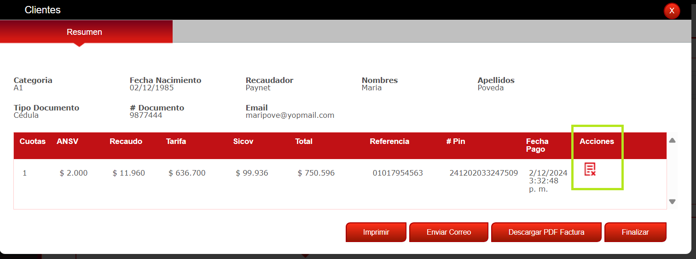
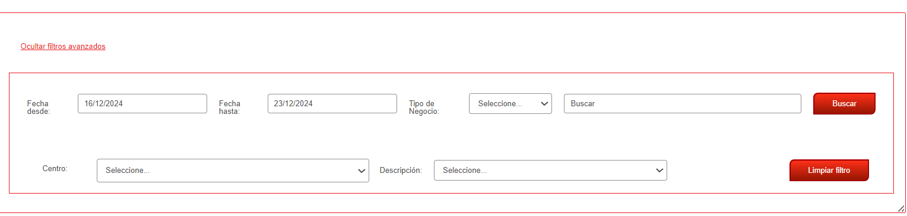
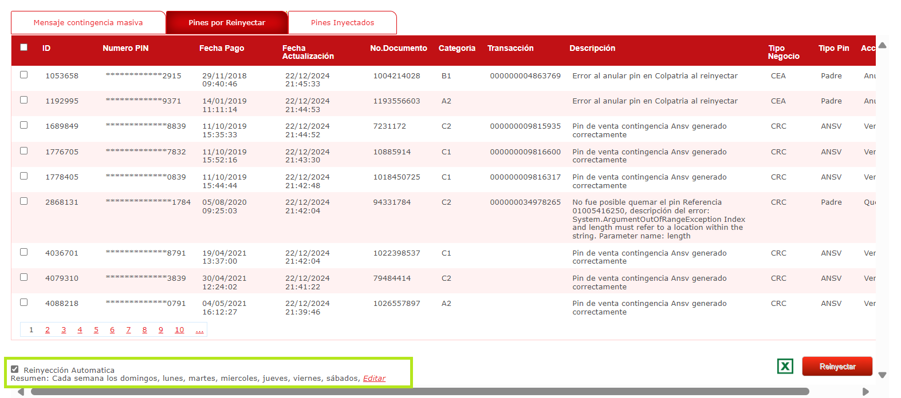

.. autosummary::
   :toctree: generated

7. OPERACIÓN
=================

En esta sección, podrá encontrar las opciones disponibles para el rol.

.. raw:: html

   

   

.. raw:: html

      
<strong><em>Imagen. Menú Operación</em></strong>

   

7.1 Listado clientes
------

Esta sección permite visualizar a los clientes que han sido registrados en el sistema o a aquellos a quienes se les ha vendido un curso.

.. raw:: html

   

      <strong><em>Imagen. Listado Cliente</em></strong>
   

Puede realizar búsquedas utilizando los siguientes filtros:

**• Fecha desde:** Ingrese la fecha de inicio del rango que desea buscar.

**• Fecha hasta:** Ingrese la fecha de fin del rango que desea buscar.

**• Buscar:** En este campo puede escribir el nombre o el ID del cliente que desea buscar.

Una vez completados los campos, tiene las siguientes opciones:

**• Buscar:** Haga clic para ejecutar la búsqueda según los criterios ingresados.

**• Limpiar filtro:** Haga clic para borrar los filtros y reiniciar la búsqueda.

Tiene la opción de navegar entre pestañas, las opciones que tiene son:

7.2.1 En proceso
*************

El listado que vera es porque se hizo la compra pero el pin no está consumido.

.. raw:: html

   

      <strong><em>Imagen. Listado Cliente en proceso</em></strong>
   

7.2.2 Finalizados
*************

Cuando los estados ya estan consumidos

.. raw:: html

   

      <strong><em>Imagen. Listado Cliente Finalizado</em></strong>
   

Vera que al seleccionar un Id en la tabla el campo acción tiene una nota crédito

.. raw:: html

   

      <strong><em>Imagen. Nota crédito</em></strong>
   

En esta sección, es posible generar notas de crédito por un valor determinado:

   - Si el crédito ya fue consumido, el sistema mostrará el valor que se debe devolver al cliente en ese caso específico.

   - En caso de que el crédito no haya sido consumido, se indicará el valor correspondiente a devolver al cliente.

A continuación se presenta un ejemplo:

.. raw:: html

   

      <strong><em>Imagen. Ejemplo Nota crédito</em></strong>
   

Debe ingresar el valor de la nota de crédito que desea generar (Puede ser todo el valor de la tarifa o una parte).

• Si está seguro del valor, haga clic en "Aceptar".

• Si desea verificar el monto antes de proceder, haga clic en "Cancelar" para revisar el valor ingresado.

Si selecciona "Aceptar", la pantalla se actualizará automáticamente y aparecerá un nuevo botón llamado "Nota de crédito".

.. raw:: html

   

      <strong><em>Imagen. Botón Nota crédito</em></strong>
   

Al hacer clic en el botón "Nota de crédito", se pueden realizar las siguientes acciones:

.. raw:: html

   

      <strong><em>Imagen. Listado Nota crédito</em></strong>
   

1. Visualizar notas de crédito existentes:

• El sistema muestra un listado con todas las notas de crédito generadas para el cliente, incluyendo detalles como el valor, el identificador de la nota, y la factura asociada.

2. Generar múltiples notas de crédito:

• Es posible crear varias notas de crédito para un cliente, siempre que el valor total no exceda el monto disponible de la tarifa.

• Si intenta superar este valor, el sistema emitirá una alerta para informarle que ha alcanzado el límite.

• Hasta que no complete el valor de la tarifa seguirá viendo las nota crédito, al completarlo no vera más en la tabla la acción de Nota crédito. 

3. Descargar el detalle de una nota de crédito en formato PDF:

• Haciendo clic en el botón correspondiente, puede visualizar y descargar un PDF con los detalles de la nota de crédito generada.

• Este documento incluye:

   - El valor de la nota de crédito.

   - Información del centro asociado.

   - Datos del cliente para el cual se creó la nota.

   - El identificador de la nota de crédito.

   - La factura original sobre la cual se aplicó la nota.

Debe dar clic en finalizar para seguir navegando en el sistema. 

7.2.3 Caducados
*************

Lista los Pines caducados. 

.. raw:: html

   

      <strong><em>Imagen. Listado Cliente Caducado</em></strong>
   

7.2.4 Anulados
************

Lista los Pines anulados.

.. raw:: html

   

      <strong><em>Imagen. Listado Cliente Anulado</em></strong>
   

7.2 Transacciones
------

La sección de Transacciones muestra toda la información relacionada con las transacciones realizadas, como su historial completo.

.. raw:: html

   

      <strong><em>Imagen. transacciones</em></strong>
   

Puede realizar búsquedas utilizando los siguientes filtros:

**• Fecha desde:** Ingrese la fecha de inicio del rango que desea buscar, no permite filtrar por más de un mes.

**• Fecha hasta:** Ingrese la fecha de fin del rango que desea buscar, no permite filtrar por más de un mes.

**• Buscar:** En este campo puede escribir el nombre o el ID del cliente que desea buscar.

Una vez completados los campos, tiene las siguientes opciones:

**• Buscar:** Haga clic para ejecutar la búsqueda según los criterios ingresados.

**• Limpiar filtro:** Haga clic para borrar los filtros y reiniciar la búsqueda.

**Campos de la tabla:**

El sistema presenta una tabla con la información de las transacciones, y ofrece la opción de exportar los datos en formato Excel. Para descargar el archivo, haga clic en el ícono de "X" (color verde) ubicado en la parte superior derecha de la tabla.

.. raw:: html

   

      <strong><em>Imagen. Descargar</em></strong>
   

7.3 Contigencia
***********

Este modulo esta para configurar la contingencia al centro, se asigna un monto de dinero a la cuenta para que puedan seguir operando en caso de problemas técnicos, como la caída de algún servicio bancario.
Durante este período, los Pines vendidos se registran en el sistema de contingencia y son enviados a la pantalla Pines por reinyectar. 

A continuación se explica este modulo.

.. raw:: html

   

      <strong><em>Imagen. Contigencia</em></strong>
   

Puede realizar búsquedas selecionado "Ver filtros avanzados":

.. raw:: html

   

      <strong><em>Imagen. Ver filtros avanzados</em></strong>
   

**• Fecha desde:** Ingrese la fecha de inicio del rango que desea buscar, no permite filtrar por más de un mes.

**• Fecha hasta:** Ingrese la fecha de fin del rango que desea buscar, no permite filtrar por más de un mes.

**• Tipo de negocio:** Selecione del menú desplegable las opciones que tiene disponible.

**• Buscar:** En este campo puede escribir el nombre de lo que desea buscar.

**• Centro:** puede escribir o selecionar de la lista desplegable el centro a buscar.

**• Descripción:** Selecione la descripcion en el menú desplegable.

Una vez completados los campos, tiene las siguientes opciones:

**• Buscar:** Haga clic para ejecutar la búsqueda según los criterios ingresados.

**• Limpiar filtro:** Haga clic para borrar los filtros y reiniciar la búsqueda.

A continuacion vera 3 pantallas las cuales puede navegar entre ellas:

**• Mensaje contingencia masiva**

**• Pines por Reinyectar**

**• Pines Inyectados**

7.3.1 Mensaje contingencia masiva
*****

.. raw:: html

   

      <strong><em>Imagen. Mensaje contingencia masiva</em></strong>
   

En casos de contingencia masiva, cuando el banco notifica la caída de sus servicios, se puede utilizar la opción de "Mensaje contingencia masiva" para informar a los centros.

Puede redactar el mensaje por medio de los siguientes campos:

**• Habilitar Mensaje de Contingecia ** tiene un check para marcar si desea que sea para todos (Perfil recepcionista).

**• Mensaje de Notificacion:** 

**• Mensaje Legal** 

**• Mensaje Legal** 

Una vez completados los campos, tiene las siguientes opciones:

**• Guardar:** Haga clic para guardar el mensaje.

**• Cancelar:** Haga clic para cancelar el mensaje.

7.3.2 Pines por Reinyectar
****

.. raw:: html

   

      <strong><em>Imagen. Pines por Reinyectar</em></strong>
   

   

En esta pantalla se visualizan los PINs que aún están pendientes de ser procesados o reinyectados en el sistema una vez que se restablezca el servicio. Esto permite a los operadores:

Identificar cuáles Pines están pendientes de ser reinyectados.
Determinar el monto total que el banco está adeudando debido a estas operaciones.

Adicionalmente, existe la opción de reinyección automática, que permite procesar automáticamente los PINs pendientes. 

.. raw:: html

   

      <strong><em>Imagen. Reinyección automática</em></strong>
   

Al seleccionarla, se abre una ventana donde se gestiona este proceso.

.. raw:: html

   

      <strong><em>Imagen. Reinyección automática</em></strong>
   

Una vez completados los campos, tiene las siguientes opciones:

**• Listo:** Haga clic para guardar.

**• Cancelar:** Haga clic para cancelar.

En la esquina inferior derecha se encuentra el botón "Reinyectar". Para realizar el proceso, es necesario seleccionar al menos un PIN.

.. image:: ../images/BotonReinyectar.png
   :width: 100%
   :alt: Botón Reinyectar

.. raw:: html

   

      <strong><em>Imagen. Botón Reinyectar </em></strong>
   

7.3.3 Pines Inyectados
****

.. raw:: html

   

      <strong><em>Imagen. Pines Inyectados</em></strong>
   

   

Una vez que el banco liquida la deuda y el pago se confirma, los Pines pasan a la vista de "Pines inyectados", lo que significa que ya no hay obligaciones pendientes.

