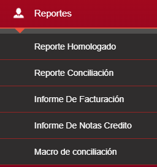
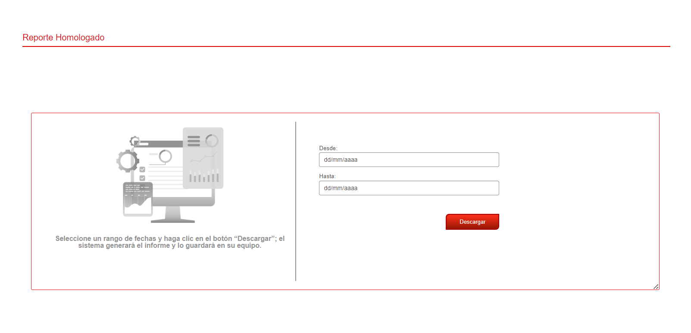
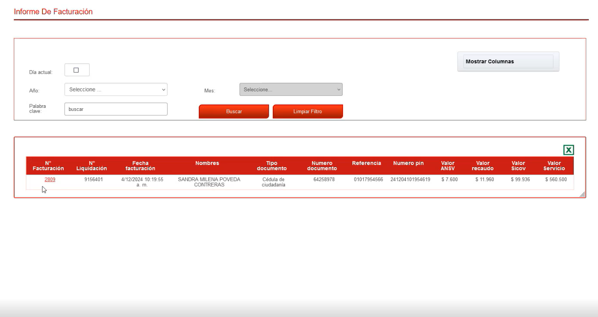
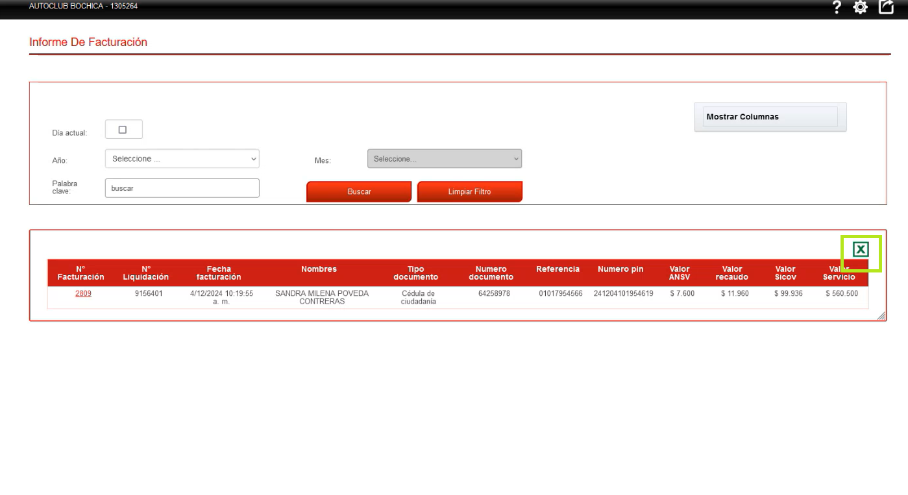
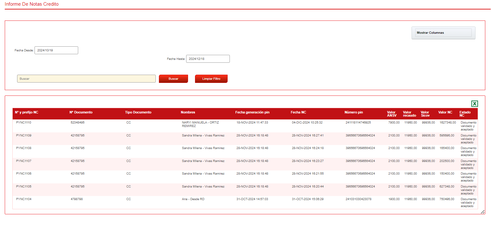
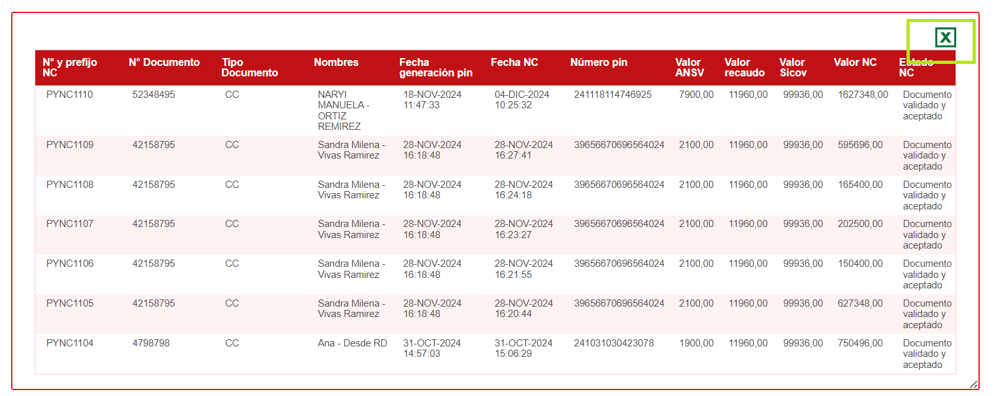

.. autosummary::
   :toctree: generated

8. REPORTES
=================

El usuario administrador tiene la opción de ver reportes

.. raw:: html

   

   

.. raw:: html

      
<strong><em>Imagen. Menú Reportes</em></strong>

   

8.1 Reporte Homologado
---------

Genera un reporte de de las transacciones a un mes (Queda pendiente explicación)

.. raw:: html

   

      <strong><em>Imagen. Reporte Homologado</em></strong>
   

8.2 Reporte Conciliación
---------

Genera un reporte de de las transacciones a un mes (Queda pendiente explicación)

.. image:: ../images/ReporteConciliación.png
   :width: 100%
   :alt:  Reporte Conciliación

.. raw:: html

   

      <strong><em>Imagen. Reporte Conciliación</em></strong>
   

8.3 Informe De Facturación
--------

El Informe de Facturación estará disponible únicamente si el centro cuenta con facturación habilitada.

• En esta sección, se muestran todos los documentos o facturas generadas para los clientes.

• Los datos visibles incluyen, entre otros, el número de factura asociado a cada transacción.

.. raw:: html

   

      <strong><em>Imagen. Informe De Facturación</em></strong>
   

Puede realizar búsquedas utilizando los siguientes filtros:

**• Día actual:** cuenta con un botón para seleccionar la fecha actual.

**• Año:** Selección del menú desplegable el año.

**• Mes:** Seleccione del menú desplegable el mes. 

**• Palabra clave:** En este campo puede escribir alguna palabra clave que le ayude con la consulta.

Una vez completados los campos, tiene las siguientes opciones:

**• Buscar:** Haga clic para ejecutar la búsqueda según los criterios ingresados.

**• Limpiar filtro:** Haga clic para borrar los filtros y reiniciar la búsqueda.

**Campos de la tabla:**

El sistema presenta una tabla con la información detallada del informe de facturación, y ofrece la opción de exportar los datos en formato Excel. Para descargar el archivo, haga clic en el ícono de "X" (color verde) ubicado en la parte superior derecha de la tabla.

.. raw:: html

   

      <strong><em>Imagen. Descargar</em></strong>
   

8.2 Informe De Notas creditos
--------

En la sección de Notas de Crédito, se puede consultar la siguiente información:

• Cantidad de notas de crédito generadas: Muestra el total de notas de crédito creadas en el centro.

• Estado de las notas de crédito:

   - Indica si el documento fue aceptado por Colfactura.
   - En caso de rechazo, informa que es necesario reenviar el documento.

.. raw:: html

   

      <strong><em>Imagen. Informe De Notas Creditos</em></strong>
   

Puede realizar búsquedas utilizando los siguientes filtros:

**• Fecha desde:** Ingrese la fecha de inicio del rango que desea buscar.

**• Fecha hasta:** Ingrese la fecha de fin del rango que desea buscar.

**• Buscar:** En este campo puede escribir el nombre o el ID del cliente que desea buscar.

Una vez completados los campos, tiene las siguientes opciones:

**• Buscar:** Haga clic para ejecutar la búsqueda según los criterios ingresados.

**• Limpiar filtro:** Haga clic para borrar los filtros y reiniciar la búsqueda.

**Campos de la tabla:**

El sistema presenta una tabla con la información detallada del informe de notas crédito, y ofrece la opción de exportar los datos en formato Excel. Para descargar el archivo, haga clic en el ícono de "X" (color verde) ubicado en la parte superior derecha de la tabla.

.. raw:: html

   

      <strong><em>Imagen. Descargar</em></strong>
   

